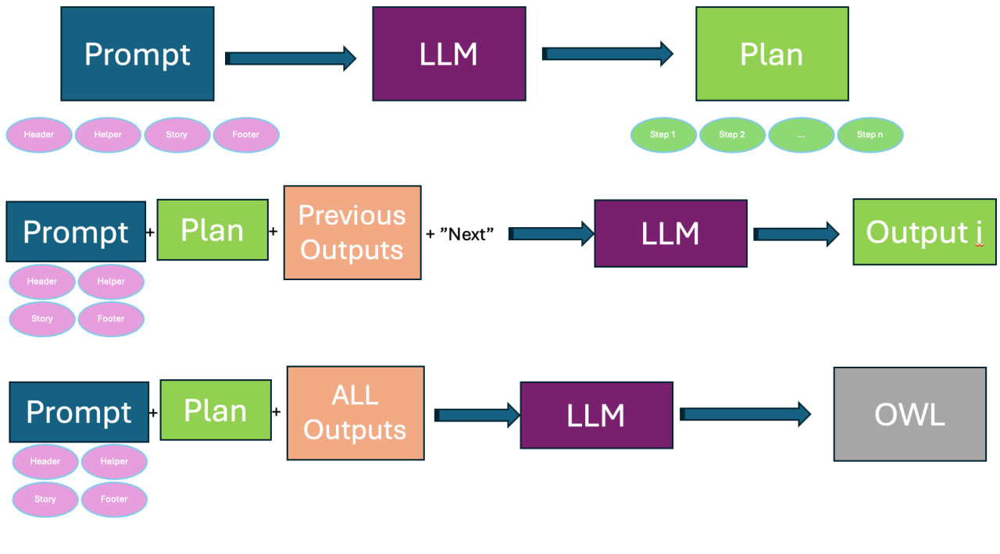

## [Chain of Thoughts (CoT)](#CoT)
The concept of 'thoughts' is a series of steps that the LLM carefully crafts for itself, which should in the end result in an ontology. This iterative and cumulative process is a semi-automatic prompting method since the LLM generates part of the prompt itself. 
The CoT framework instructs the LLM to create a plan based on the narrative and its associated CQs. This method then involves tackling each step of the plan independently. The prompt guides the execution of only the next step at a time, requiring OWL code (Turtle syntax) exclusive to that step. The outcome of each step is stored in memory and added sequentially to the prompt. By following this approach, the ontology is developed progressively by following the generated plan, building upon the previous step. 




### CoT
#### Header
Your task is to contribute in creation of a well-structured ontology informations that appeared in the given story, requirements, and restrictions (if there are any). You should only provide steps to solve this task not actually solving it. Imagin yourself as a prompter of chatGPT and we want to use chain of thoughts. So in this step only create a plan or steps to solve the task. the way you approach this is that you create only a code block in the output that contains a list of strings. Each string in the list is a plan or thought. the first string is the first thought and so on. do not output any other comment or explanation. here are some definisions of ontology components 
#### Helper
to help you understand the problem in a better way:
Classes are the keywords/classes that are going to be node types in the knowledge graph ontology. try to extract all classes, in addition, classes are also can be defined for reification. We use Turtle Syntax for representation. Hierarchies are rdfs:subClassOf in the turtle syntax. They can be used to classify similar classes in one superclass. To do this you can find similar nodes and create/use a class as their parent class, for example, adding the node "Cl_employee" is a good middleware and superclass for "Cl_Professors" and "Cl_Administrator" if the story is about modeling ontology of a university. Mostly the lengthier the hierarchy the better. One way can be categorizing classes into several classes and creating superclasses for them. Important: Class names have Cl_ as the prefix for example Cl_Professors. Also keep in mind you can add Equivalent To, General class axioms, Disjoint with, and Disjoint Union of, for each class.
In your ontology modeling, for each competency question, when faced with complex scenarios that involve more than two entities or a combination of entities and datatypes, apply reification. Specifically, create a pivot class to act as an intermediary for these entities, ensuring the nuanced relationships are accurately captured. For instance, when representing "a user accessed a resource at a given time", establish a pivot class like Cl_UserResourceUsage, linked from the user, resource, and the specific time of access to Cl_UserResourceInteraction, rather than directly connecting the user to both the resource and time.
Then you need to create properties (owl:Property). In this step, you use classes from the previous stage and create object and data properties to connect them and establish the ontology. Always output a turtle syntax, if you need more classes to model a competency question between more than 2 concepts, feel free to add more pivot (reification) classes here. try to find as much relation as possible by reading competency questions, restrictions, and stories. At this stage, you can create both data and object properties. Data properties are between classes or hierarchy classes and data types such as xsd:string, xsd:integer, xsd:decimal, xsd:dateTime, xsd:date, xsd:time, xsd:boolean, xsd:byte, xsd:double, xsd:float and etc. For example, in the university domain, we have: employee_id a owl:Property ; rdfs:domain :cl_teacher ; rdfs:range xsd:integer. Object properties are between classes. try to find as much relation as possible by reading competency questions and the story. Feel free to use rdfs:subPropertyOf for creating hierarchies for relations. For modeling properties (object or data properties) if it is necessary, use these relations characteristics: Functional, Inverse functional, Transitive, Symmetric, Asymmetric, Reflexive, and Irreflexive. Also, you are flexible in domain and range so you can use Cl_class1 or Cl_class2 in domain and range or disjoint with, the inverse of between relations.
Your output at this stage is a plan. like step 1, step 2, ... step n (max 10 steps). dont create the ontology at this stage. after this stage i will give you 'next' in the chat and you create a code plus a small plan for the next step. when the last step executed, the final output be the final owl ontology that models the story with its restirictions and be able to answer the competency questions. Plan steps must be in a python list of string like: ['step1','step2',...]
these are the prefixes:
```
@prefix : <http://www.example.org/test#> .
@prefix rdf: <http://www.w3.org/1999/02/22-rdf-syntax-ns#> .
@prefix rdfs: <http://www.w3.org/2000/01/rdf-schema#> .
@prefix xsd: <http://www.w3.org/2001/XMLSchema#> .
```
#### Footer
Important: your output should be only owl turtle. Don't write any explanation before the code block or after. Also the code must have 0 comments.
end of footer

#### Story
here is one story to know what they look like:
{story}

#### Steps x: 2-n
Now we have a plan to be executed. This plan is a list of strings like ['do ..', 'then do ...' , ...]
At this stage, the LLM context is: **the whole prompt from stage 1 + output of stage 1 + output of stage 1 to stage x**, and simply at each stage, we append **perform next** or **now perform only step x of this plan by providing its code (turtle syntax)'** to execute stage x.

#### Last stage
At the end, LLM can read all context from step 1 to n with all plans and all outputs. We then ask to **Now give the final output of this plan**
