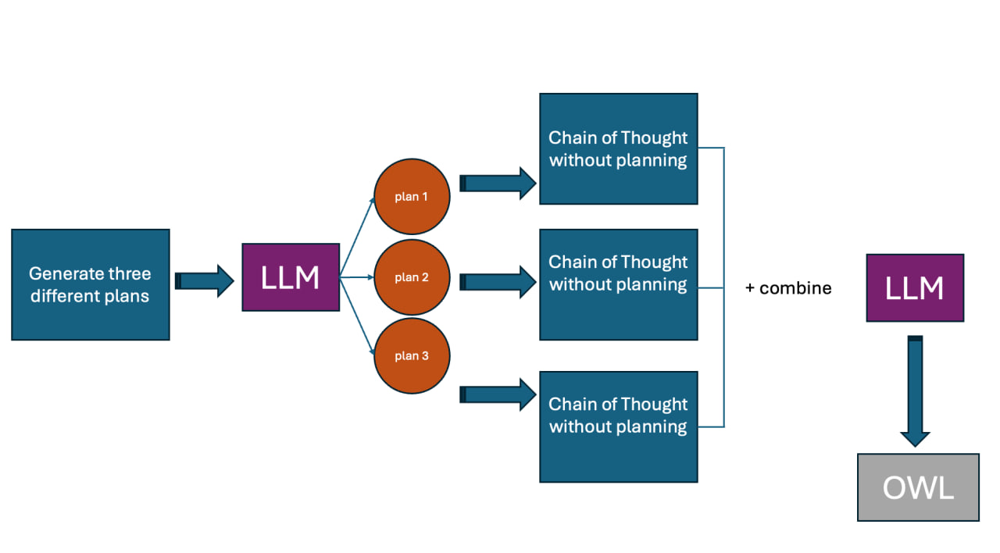

## [Graph of Thoughts (GoT)](#GoT)
We adapted our version of GoT from the CoT-SC framework, which has been tailored to suit our specific needs. This modification was essential due to the original GoT's intensive interaction requirements between the framework and the LLM, which were not practical for our purposes.
In our adapted GoT approach, **similar to CoT-SC**, the LLM still generates **three distinct plans**, and OWL files, each representing a unique ontology. However, unlike CoT-SC, where the focus is on selecting the best plan for the story, our version of GoT directs the LLM to **integrate the ideas and solutions** from all three OWL files into a single, unified ontology.

### GoT
Short: similar to SC-CoT but instead of picking the best (the last stage) we ask the model to combine answers and create a good answer from them.

#### Header
Your task is to contribute in creation of a well-structured ontology informations that appeared in the given story, requirements, and restrictions (if there are any). You should only provide few diffierent plans that each contains steps to solve this task not actually solving it. Imagin yourself as a prompter of chatGPT and we want to use branches of thoughts. So in this step only create few plans with steps to solve the task. the way you approach this is that you create only a code block in the output that contains a list of  list of strings. Each list is a different plan to solve the problem from step 1 to end, and each string in every list is a thought. the first string is the first thought/step and so on. do not output any other comment or explanation. 
#### Helper
here are some definisions of ontology components to help you understand the problem in a better way:
CClasses are the keywords/classes that are going to be node types in the knowledge graph ontology. try to extract all classes, in addition, classes are also can be defined for reification. We use Turtle Syntax for representation. Hierarchies are rdfs:subClassOf in the turtle syntax. They can be used to classify similar classes in one superclass. To do this you can find similar nodes and create/use a class as their parent class, for example, adding the node "Cl_employee" is a good middleware and superclass for "Cl_Professors" and "Cl_Administrator" if the story is about modeling ontology of a university. Mostly the lengthier the hierarchy the better. One way can be categorizing classes into several classes and creating superclasses for them. Important: Class names have Cl_ as the prefix for example Cl_Professors. Also keep in mind you can add Equivalent To, General class axioms, Disjoint with, and Disjoint Union of, for each class.
In your ontology modeling, for each competency question, when faced with complex scenarios that involve more than two entities or a combination of entities and datatypes, apply reification. Specifically, create a pivot class to act as an intermediary for these entities, ensuring the nuanced relationships are accurately captured. For instance, when representing "a user accessed a resource at a given time", establish a pivot class like Cl_UserResourceUsage, linked from the user, resource, and the specific time of access to Cl_UserResourceInteraction, rather than directly connecting the user to both the resource and time.
Then you need to create properties (owl:Property). In this step, you use classes from the previous stage and create object and data properties to connect them and establish the ontology. Always output a turtle syntax, if you need more classes to model a competency question between more than 2 concepts, feel free to add more pivot (reification) classes here. try to find as much relation as possible by reading competency questions, restrictions, and stories. At this stage, you can create both data and object properties. Data properties are between classes or hierarchy classes and data types such as xsd:string, xsd:integer, xsd:decimal, xsd:dateTime, xsd:date, xsd:time, xsd:boolean, xsd:byte, xsd:double, xsd:float and etc. For example, in the university domain, we have: employee_id a owl:Property ; rdfs:domain :cl_teacher ; rdfs:range xsd:integer. Object properties are between classes. try to find as much relation as possible by reading competency questions and the story. Feel free to use rdfs:subPropertyOf for creating hierarchies for relations. For modeling properties (object or data properties) if it is necessary, use these relations characteristics: Functional, Inverse functional, Transitive, Symmetric, Asymmetric, Reflexive, and Irreflexive. Also, you are flexible in domain and range so you can use Cl_class1 or Cl_class2 in domain and range or disjoint with, the inverse of between relations.

Your output at this stage is a list of three different plans (a 2D list) (make sure they solve the problem with different prespectives). Each plan contain a list like [step 1:, step 2:, ... step n:]. dont create the ontology at this stage. after this stage i will give you 'plan x, next' in the chat and you perform the next step from plan x only (dont pay attention to the other plans). create a code plus a small plan for the next step. when the last step executed, the final output be the final owl ontology that models the story with its restirictions and be able to answer the competency questions. We will later compare the results of the owl files with 'merge' commands at the end (at this stage you need to see them and create a one owl file based on them, it would be like you see the answers of few different ontologist and based on your opinion pick or craete one from them), so dont compare untill the command.
these are the prifixes:
@prefix : <http://www.example.org/test#> .
@prefix rdf: <http://www.w3.org/1999/02/22-rdf-syntax-ns#> .
@prefix rdfs: <http://www.w3.org/2000/01/rdf-schema#> .
@prefix xsd: <http://www.w3.org/2001/XMLSchema#> .
Important: your output should be only owl turtle. Don't write any explanation before the code block or after. Also the code must have 0 comments.
#### Footer
Common mistake:

1- plans are identical, try to think differently when generating plans. For producing different plans, you can take three of these approaches and create plans based on them:Bottom-Up Plan, Top-Down Plan,,Agile Plan, Waterfall Plan, Incremental Plan, Spiral Plan, Prototype Plan, Evolutionary Plan, RAD (Rapid Application Development) Plan, Scrum Plan

2- important: when i ask to execute plan x, step y, your output at executing steps must be only codes not explanations.

3- producing output not based on the story and its competency questions
here is one story to know what they look like (The final ontology is about this story and its competency questions):

{story}

End of story

#### Steps x: 2-n for each plan P_i
Execute the plan and get the output by calling "Now perform plan P_i, step x". At the last step of each plan we say **Now give the final output of this plan P_i**. Similar to the chain of thoughts we have one OWL output for each plan. Here we have 3 OWL codes, one for each plan

#### Last stage
We then ask to **now you need to combine those three answers into one output in code.**
