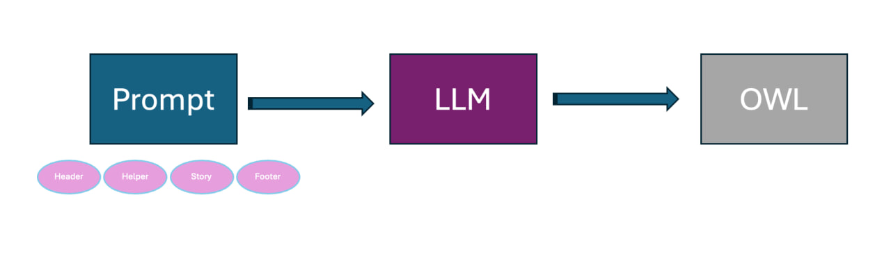
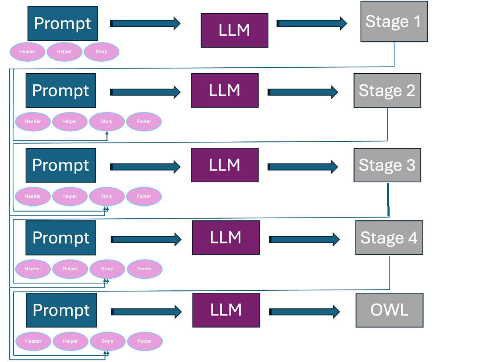
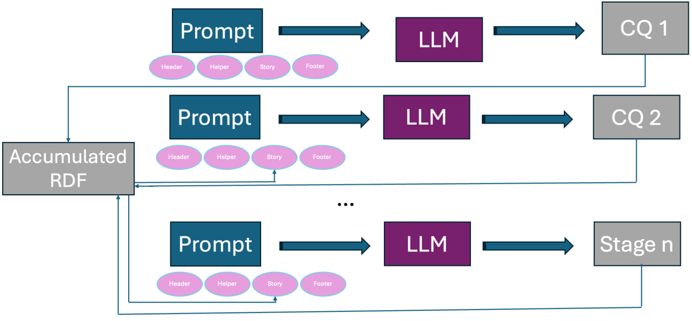
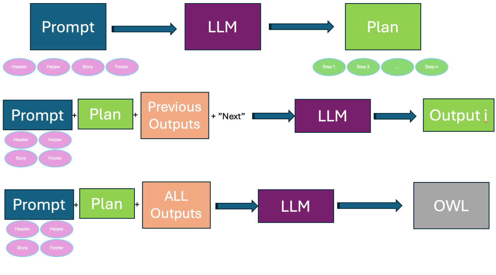
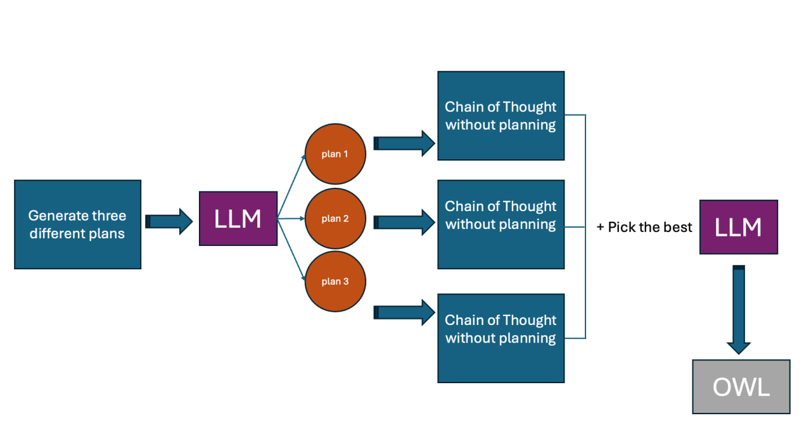
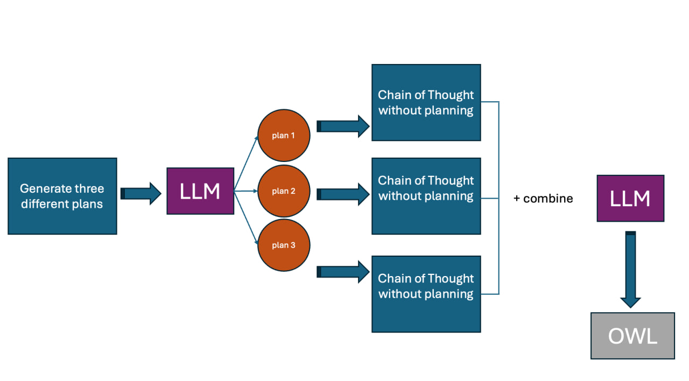

# Prompts and Promoting Techniques

## Table of Contents
- [Prompts](#prompts)
  - short descriptions
    - Zero-Shot Prompting
    - Sub-task Decomposed Prompting: Waterfall approach
    - Sub-task Decomposed Prompting: Competency Question by Competency Question (CQbyCQ)
    - Chain of Thoughts
    - Self Consistency with Chain of Thoughts (CoT-SC)
    - Graph of Thoughts (GoT)
  - detail of prompts
    - Detail of Zero-Shot
    - Detail of Sub-task Decomposed Prompting: Waterfall approach
    - Detail of Sub-task Decomposed Prompting: Competency Question by Competency Question (CQbyCQ)
    - Detail of Chain of Thoughts
    - Detail of Self Consistency with Chain of Thoughts (CoT-SC)
    - Detail of Graph of Thoughts (GoT)
      
## [Zero-Shot](#ZeroShot)
This method entails a one-time interaction with the LLM, requiring no iteration or feedback loop, utilizing a prompt composed of the four components outlined in the previous section: the **header**, **helper**, **story**, and **footer**. Together, the sections of the prompt provide all the information needed for ontology construction in a single interaction.




## [Sub-task Decomposed Prompting - Waterfall](#Waterfall)
The LLM prompting method involves **five stages**. Initially, the LLM translates core requirements into short descriptions. In the second stage, it extracts classes. In the third stage, it constructs a taxonomy. The fourth stage defines connections between established classes, and the fifth stage creates data properties. Each step includes instructions on how to establish restrictions. 
Each stage has four components: the **header**, **helper**, **story**, and **footer**. Each is designed based on the stage.
By clicking on the link, you can read details of every prompt dection in more detail.




## [Sub-task Decomposed Prompting - Competency Question by Competency Question (CQbyCQ)](#CQbyCQ)
In this approach, the LLM is instructed to address **one CQ at a time**, i.e., the requirements are decomposed rather than the task itself. At each step, the LLM  formulates the ontology pertinent to that specific CQ, and the framework **immediately integrates** it with the ontologies crafted in the preceding steps. The instructive nature of the header is essential in this method; it distinctly describes the task, states which CQ is chosen, and instructs the LLM to craft classes and properties etc. for that specific requirement. Meanwhile, the **helper, story, and footer** sections of the strategy remain similar to the Zero-shot approach, providing foundational guidance, narrative context, and insights into potential errors. This can be seen as an incremental approach for building the ontology and by the modelling of the final CQ, the framework should have pieced together an integrated ontology for the entire narrative. **Merging CQ-specific** ontologies is simply done by appending the current answer to the previous OWL code in the memory. 



## [Chain of Thoughts (CoT)](#CoT)
The concept of 'thoughts' is a series of steps that the LLM carefully crafts for itself, which should in the end result in an ontology. This iterative and cumulative process is a semi-automatic prompting method since the LLM generates part of the prompt itself. 
The CoT framework instructs the LLM to create a plan based on the narrative and its associated CQs. This method then involves tackling each step of the plan independently. The prompt guides the execution of only the next step at a time, requiring OWL code (Turtle syntax) exclusive to that step. The outcome of each step is stored in memory and added sequentially to the prompt. By following this approach, the ontology is developed progressively by following the generated plan, building upon the previous step. 



## [Self Consistency with Chain of Thoughts (CoT-SC)](#CoT-SC)
The CoT-SC prompting technique, while bearing a resemblance to the CoT approach in its stepwise progression towards an end goal, is distinguished through the implementation of three distinct plans. Unlike CoT, which follows a singular trajectory, CoT-SC branches out into three separate pathways, each culminating in its own unique ontology. In this method, the critical task of the LLM is to evaluate and determine which path is better at modelling the story.  
To ensure the generation of three diverse plans, the temperature and penalty parameters (they control the randomness and self-repetition of LLMs respectively) of the LLM are set from 0 to 0.5, only for this stage. This setting is crucial as it promotes variability and creativity in the LLM's responses (avoiding three identical plans). Finally after producing the output of three plans, LLM is instructed to pick the best plan.
Consequently, this approach allows for the exploration of a broader range of potential ontologies, each offering a different perspective and solution to the narrative and its corresponding questions. 




## [Graph of Thoughts (GoT)](#GoT)
We adapted our version of GoT from the CoT-SC framework, which has been tailored to suit our specific needs. This modification was essential due to the original GoT's intensive interaction requirements between the framework and the LLM, which were not practical for our purposes.
In our adapted GoT approach, **similar to CoT-SC**, the LLM still generates **three distinct plans**, and OWL files, each representing a unique ontology. However, unlike CoT-SC, where the focus is on selecting the best plan for the story, our version of GoT directs the LLM to **integrate the ideas and solutions** from all three OWL files into a single, unified ontology.





## ZeroShot
### Header
Your task is to contribute to the creation of well-structured ontology information that appeared in the given story, requirements, and restrictions (if there are any).
### Helper
The way to approach this is you first create classes with their hierarchies. Classes are the keywords/classes that are going to be node types in the knowledge graph ontology. try to extract all classes, in addition, classes are also can be defined for reification. We use Turtle Syntax for representation. Hierarchies are rdfs:subClassOf in the turtle syntax. They can be used to classify similar classes in one superclass. To do this you can find similar nodes and create/use a class as their parent class, for example, adding the node "Cl_employee" is a good middleware and superclass for "Cl_Professors" and "Cl_Administrator" if the story is about modeling ontology of a university. Mostly the lengthier the hierarchy the better. One way can be categorizing classes into several classes and creating superclasses for them. Important: Class names have Cl_ as the prefix for example Cl_Professors. Also keep in mind you can add Equivalent To, General class axioms, Disjoint with, and Disjoint Union of, for each class.   
In your ontology modeling, for each competency question, when faced with complex scenarios that involve more than two entities or a combination of entities and datatypes, apply reification. Specifically, create a pivot class to act as an intermediary for these entities, ensuring the nuanced relationships are accurately captured. For instance, when representing "a user accessed a resource at a given time", establish a pivot class like Cl_UserResourceUsage, linked from the user, resource, and the specific time of access to Cl_UserResourceInteraction, rather than directly connecting the user to both the resource and time.  
Then you need to create properties (owl:Property). In this step, you use classes from the previous stage and create object and data properties to connect them and establish the ontology. Always output a turtle syntax, if you need more classes to model a competency question between more than 2 concepts, feel free to add more pivot (reification) classes here. try to find as much relation as possible by reading competency questions, restrictions, and stories. At this stage, you can create both data and object properties. Data properties are between classes or hierarchy classes and data types such as xsd:string, xsd:integer, xsd:decimal, xsd:dateTime, xsd:date, xsd:time, xsd:boolean, xsd:byte, xsd:double, xsd:float and etc. For example, in the university domain, we have: employee_id a owl:Property ; rdfs:domain :cl_teacher ; rdfs:range xsd:integer. Object properties are between classes. try to find as much relation as possible by reading competency questions and the story. Feel free to use rdfs:subPropertyOf for creating hierarchies for relations. For modeling properties (object or data properties) if it is necessary, use these relations characteristics: Functional, Inverse functional, Transitive, Symmetric, Asymmetric, Reflexive, and Irreflexive. Also, you are flexible in domain and range so you can use Cl_class1 or Cl_class2 in domain and range or disjoint with, the inverse of between relations.  
It is common to forget to add relations that are related to reification: In RDF reification, achieving precise modeling is pivotal, especially when handling multifaceted scenarios where mere binary associations fall short. Take for instance the statement, "a user used a resource at a time". While it might initially seem to involve a direct link between a 'user' and a 'resource', it inherently embodies three entities: a 'user', a 'resource', and a 'time'. Directly connecting 'user' to both 'resource' and 'time' fails to capture the essence of the statement, as it obscures which resource was utilized by the user at a specific time. To address this, a more sophisticated modeling approach is needed, invoking a pivot class, Cl_usingResource. This pivot class acts as an intermediary, linking both Cl_user and Cl_resource. Furthermore, it integrates a time property to denote the exact instance of usage. By employing this method, we can coherently model the statement, ensuring that the user's interaction with a specific resource at a distinct time is unambiguously represented. This approach highlights the imperative of ontology design patterns and the necessity of intermediary nodes when modeling complex relationships involving multiple entities or a mix of entities and datatypes.  
Upon implementation of restrictions, feel free to use owl:equivalentClass [ rdf:type owl:Restriction ;  owl:onProperty :{relation} ;  owl:allValuesFrom :{Class} ] ; in this way, you can put restrictions for classes such as class Cl_C1 is the only class that uses the relation R. or you can put soft restrictions by using owl:someValuesFrom. Also, you can use general class axioms: [ rdf:type owl:Restriction ; owl:onProperty :R1 ; owl:someValuesFrom :Cl_1 ; rdfs:subClassOf :Cl_2 ] when you want to put restrictions on the definition of a class based on its relation and the definition is necessary but not enough (if it is enough it would be equivalent to owl:equivalentClass).
```
these are the prefixes:  
@prefix : <http://www.example.org/test#> .  
@prefix rdf: <http://www.w3.org/1999/02/22-rdf-syntax-ns#> .  
@prefix rdfs: <http://www.w3.org/2000/01/rdf-schema#> .  
@prefix xsd: <http://www.w3.org/2001/XMLSchema#> .
```
### Story
Ontology story comes from users' input 

### Helper (pitfalls)

Important: your output should be only code. Don't write any explanation before the code block or after. Also, the code must have 0 comments.  
Besides here are some possible mistakes that you might make:  
1- forgetting to add prefixes at the beginning of the code.
2- forgetting to write pivot classes at the beginning before starting to code.
common mistakes in the class extraction:  
1- not extracting all classes and missing many of them. classes can be found in stories, competency questions (also a CQ can be a class if it is complex), and restrictions.  
2- returning empty answer  
3- providing comments or explanations, except, write one line and only just the name of the reification classes needed for each CQ before starting to code: CQ#1: Cl_Class1Class2 ... CQ#3: .... nothing else  
4- extracting classes like 'Date' is wrong since they are data properties.    
5- not using RDF reification: not extracting pivot classes for modeling relation between classes (more than one class and one dataproperty, or more than two classes)  
common mistakes in the hierarchies:  
1- creating an ontology for non-existing classes.  
2- returning empty answer or very short  
3- extracting attributes such as date, time, and string names that are related to data properties  
common mistakes in the properties:  
1- returning an empty answer or a very short  
2- do not forget to add relations for the pivot class that was created, all of the necessary classes in the CQ should be connected to the pivot class
3- when the pivot class is created, all of the related classes should point to it (direction of relation is from the classes (domains) 'to'  pivot class (range))

## Waterfall
### Header, Prefixes, and Definitions (common in all stages)
**Header**: 
Your task is to contribute in creation of a well-structured ontology information that appeared in the given story, requirements, and restrictions (if there are any).

**Prefixes** : 
```
these are the prefixes:
@prefix : <http://www.example.org/test#> .
@prefix rdf: <http://www.w3.org/1999/02/22-rdf-syntax-ns#> .
@prefix rdfs: <http://www.w3.org/2000/01/rdf-schema#> .
@prefix xsd: <http://www.w3.org/2001/XMLSchema#> .
```
**Definitions**:

here are some definitions of ontology components to help you understand the problem in a better way and write better hints:
Classes are the keywords/classes that are going to be node types in the knowledge graph ontology. try to extract all classes, in addition, classes are also can be defined for reification. We use Turtle Syntax for representation. Hierarchies are rdfs:subClassOf in the turtle syntax. They can be used to classify similar classes in one superclass. To do this you can find similar nodes and create/use a class as their parent class, for example, adding the node "Cl_employee" is a good middleware and superclass for "Cl_Professors" and "Cl_Administrator" if the story is about modeling ontology of a university. Mostly the lengthier the hierarchy the better. One way can be categorizing classes into several classes and creating superclasses for them. Important: Class names have Cl_ as the prefix for example Cl_Professors. Also keep in mind you can add Equivalent To, General class axioms, Disjoint with, and Disjoint Union of, for each class.
In your ontology modeling, for each competency question, when faced with complex scenarios that involve more than two entities or a combination of entities and datatypes, apply reification. Specifically, create a pivot class to act as an intermediary for these entities, ensuring the nuanced relationships are accurately captured. For instance, when representing "a user accessed a resource at a given time", establish a pivot class like Cl_UserResourceUsage, linked from the user, resource, and the specific time of access to Cl_UserResourceInteraction, rather than directly connecting the user to both the resource and time.
Then you need to create properties (owl:Property). In this step, you use classes from the previous stage and create object and data properties to connect them and establish the ontology. Always output a turtle syntax, if you need more classes to model a competency question between more than 2 concepts, feel free to add more pivot (reification) classes here. try to find as much relation as possible by reading competency questions, restrictions, and stories. At this stage, you can create both data and object properties. Data properties are between classes or hierarchy classes and data types such as xsd:string, xsd:integer, xsd:decimal, xsd:dateTime, xsd:date, xsd:time, xsd:boolean, xsd:byte, xsd:double, xsd:float and etc. For example, in the university domain, we have: employee_id a owl:Property ; rdfs:domain :cl_teacher ; rdfs:range xsd:integer. Object properties are between classes. try to find as much relation as possible by reading competency questions and the story. Feel free to use rdfs:subPropertyOf for creating hierarchies for relations. For modeling properties (object or data properties) if it is necessary, use these relations characteristics: Functional, Inverse functional, Transitive, Symmetric, Asymmetric, Reflexive, and Irreflexive. Also, you are flexible in domain and range so you can use Cl_class1 or Cl_class2 in domain and range or disjoint with, the inverse of between relations.


### Stage 1:
#### Helper

Your task is to assist students by providing hints for ontology development without giving them code. Your task is to only append some information (in a very short text) to the story. so read the story, competency questions, and restrictions, then write in short (translate) what the object properties, data properties, and reification nodes are needed. do not do any coding, just write CQ1: (competency question #1: ) object properties: rel1, rel2 ...; data properties: p1, p2, p3; classes: ...; reification nodes: Cl_n1, Cl_n2,... CQ2: ...

<code style="color : blue">{definisions}</code>

Important: do not solve the ontology (it is cheating, we want hints for students) just put the information mentioned above. Don't put any code, just write the object properties: el1, rel2 ...;
instruction for student: '
CQ1: (competency question #1: ) object properties: rel1, rel2 ...; data properties: p1, p2, p3; classes: ...; reification nodes: Cl_n1, Cl_n2,... CQ2: ...

<code style="color : blue">{prefixes}</code>

Important: your output should be only owl turtle. Don't write any explanation before the code block or after. Also, the code must have 0 comments.
### Story
Ontology story comes from users' input 

#### Footer (pitfalls)
Empty at this stage

### Stage 2:
#### Helper
The way to approach this is you first create classes. Classes are the keywords/classes that will be node types in the knowledge graph ontology (see the definitions bellow). Try to extract all classes. We use Turtle Syntax for representation. Important: Class names have Cl_ as a prefix for example Cl_Professors.  Also keep in mind you can add Equivalent To, General class axioms, Disjoint with, and Disjoint Union of, for each class. In this step, don't extract any properties (object property or data property.), only classes. extracting hierarchies and properties do not belong to this stage (so don't use subClassOf in this stage).

<code style="color :blue">{definisions}</code>


<code style="color : blue">{prefixes}</code>

### Story
Ontology story comes from users' input + <span style="color:blue">**Previous LLM output (from stage 1)**</span> 

#### Footer (pitfalls)
Besides here are some possible mistakes that you might do:

1- forgetting to add prefixes at the beginning of the code.

2- forgetting to add pivot classes (reifications).

common mistakes in the class extraction:

1- not extracting all classes and missing many of them. classes can be found in story, competency questions and restrictions.

2- returning empty answer

3- providing comments or explanations

4- extracting classes like 'Date' is wrong since they are data properties.

5- not adding prefixes at the start of the turtle or not using them or creating new one


### Stage 3:
#### Helper
The way to approach this is you first read classes in the bottom. Classes are the keywords/classes that will be node types in the knowledge graph ontology (see the definitions bellow) and represented with turtle syntax with other properties like equivalentClass or disjointWith. your output must be turtle and rewrite everything: meaning the output should be an independent turtle code. When you read the classes, now try to create a category to seperate them into a hierarchy structure. Hierarchies are subClassOf in turtle. One way to approach this is categorizing classes into different classes and creating a super class and connect them toghether: e.g. if we have classes like Cl_professor, Cl_lecturer, Cl_HR, you can create a super node called Cl_universityEmployee and they all be subClassOf this node. Some super classes in the hierarchies could be: Location, Physical Object, Role, organization, group, relationship, culture, system, etc. In this step, don't extract any properties (object property or data property.) only and only create hierarchies. extracting properties are not belong to this stage. Note you do not need to create hierarchies for reification node (optional).

<code style="color :blue">{definisions}</code>


<code style="color : blue">{prefixes}</code>


### Story
Ontology story comes from users' input + <span style="color:blue"> **First LLM output (from stage 1)** </span> +  <span style="color:blue"> **RDF code from stage 2**</span> 

### Footer (pitfalls)

Besides here are some possible mistakes that you might do:

 forgetting to add prefixes at the beginning of the code.
 
common mistakes in the class hierarchy extraction:

1- creating ontology for non-existing classes.
  
2- returning empty answer or very short

3- providing comments or explanations

4- extracting attributes such as date, time, string names that are related to data properties

5- syntax error in turtle

6- forgetting Cl_ prefix

7- forgetting to add prefixes or not adding (if any exist) Equivalent To, General class axioms, Disjoint with and Disjoint Union of, form the previous turtle code.

### Stage 4:
#### Helper
The way to approach this is you first read classes and hierarchies in the provided rdf represented with turtle syntax with other properties like equivalentClass or disjointWith. Classes are the keywords/classes that are going to be nodes types in the knowledge graph ontology. your output must be turtle and do not rewrite everything only append: meaning the output should be concatinated with the provided rdf to become an complete error free turtle code. Hierarchies are subClassOf in turtle.
Second step, after reading the rdf, is to find object properties. you should use this template: property_name rdf:type owl:Property. Object properties are defined between two classes in the ontology, meaning that domain and range must be classes not strings, integers or dates. based on the story, restrictions and competency questions try to find as much relation as possible to connect them together. in this stage do not find any data properties since they do not belong to this stage. For modeling object properties, if it is necessary, use these relations characteristics like: Functional, Inverse functional, Transitive, Symmetric, Asymmetric, Reflexive, Irreflexive, Inverse Of (reverse of another relation). Also you are flexible in domain and range so you can use Cl_class1 or Cl_class2 in domain and range or disjoint with, inverse of between relations.
Feel free to create more classes and pivot classes (reification) here, but not data properties.


<code style="color :blue">{definisions}</code>


<code style="color : blue">{prefixes}</code>

### Story
Ontology story comes from users' input + <span style="color:blue"> **First LLM output (from stage 1)** </span> +  <span style="color:blue"> **RDF code from stage 3** </span> 

### Footer 
Remeber, do not rewrite the rdf again, just append to the given rdf in turtle.

Besides here are some possible mistakes that you might do:

common mistakes in the object properties extraction, avoid these:

1- returning empty answer or very short

2- providing comments or explanations

3- writing prefixes again at the begining of your response

4- using different prefixes

5- not using owl:Property and instead writing owl:ObjectProperty
   
### Stage 4:
#### Helper
The way to approach this is you first read classes and hierarchies in the provided rdf represented with turtle syntax with other properties like equivalentClass or disjointWith. your output must be turtle and do not rewrite everything only append: meaning the output should be concatinated with the provided rdf to become an complete error free turtle code.
Second step, after reading the rdf, is to find data properties based on story and its competency questions. you should use this template: property_name rdf:type owl:Property. Data properties are defined between one class in the ontology and a data type, meaning that domain must be a class in ontology and range must be data types like xsd:string, xsd:integer, xsd:decimal, xsd:dateTime, xsd:date, xsd:time, xsd:boolean, xsd:byte, xsd:double, xsd:float and etc. based on the story, restrictions and competency questions try to find as much relation as possible to connect them together. For modeling data properties, if it is necessary, use these relations characteristics like: Disjoint with, Inverse Of (reverse of another relation), Equivalent to, Subproperty of, etc. Also you are flexible in domain and range so you can use Cl_class1 or Cl_class2 in domain  or disjoint with, inverse of between relations.
Feel free to add more classes, reification classes, object properties at this stage.


<code style="color :blue">{definisions}</code>


<code style="color : blue">{prefixes}</code>

### Story
Ontology story comes from users' input + <span style="color:blue"> **First LLM output (from stage 1)** </span> +  <span style="color:blue"> **RDF code from stage 4** </span> 


### Footer
Remeber, do not rewrite the rdf again, just append to the given rdf in turtle.

Besides here are some possible mistakes that you might do:

common mistakes in the object properties extraction, avoid these:

1- returning empty answer or very short

2- providing comments or explanations

3- writing prefixes again at the begining of your response

4- using different prefixes

5- not using owl:Property and instead writing owl:ObjectProperty

## CQbyCQ
### Header
Your task is to contribute in creation of a well-structured ontology informations that appeared in the given story, requirements, and restrictions (if there are any).
The way you approach this is first you pick this competency question number "{CQ}" and read the given turtle RDF to know what is the current ontology till this stage (it can be empty at the begining). Then you add or change the RDF so it can answer to this competency question. Your output at each stage is an independent turtle, so rewrite/edit the previous RDF and produce the new one. You only need to solve the question number so do not touch the next questions since they belong to the next stages of development. 
### Helper
you can read this definisions to understand the concepts:
lasses are the keywords/classes that are going to be node types in the knowledge graph ontology. try to extract all classes, in addition, classes are also can be defined for reification. We use Turtle Syntax for representation. Hierarchies are rdfs:subClassOf in the turtle syntax. They can be used to classify similar classes in one superclass. To do this you can find similar nodes and create/use a class as their parent class, for example, adding the node "Cl_employee" is a good middleware and superclass for "Cl_Professors" and "Cl_Administrator" if the story is about modeling ontology of a university. Mostly the lengthier the hierarchy the better. One way can be categorizing classes into several classes and creating superclasses for them. Important: Class names have Cl_ as the prefix for example Cl_Professors. Also keep in mind you can add Equivalent To, General class axioms, Disjoint with, and Disjoint Union of, for each class.
In your ontology modeling, for each competency question, when faced with complex scenarios that involve more than two entities or a combination of entities and datatypes, apply reification. Specifically, create a pivot class to act as an intermediary for these entities, ensuring the nuanced relationships are accurately captured. For instance, when representing "a user accessed a resource at a given time", establish a pivot class like Cl_UserResourceUsage, linked from the user, resource, and the specific time of access to Cl_UserResourceInteraction, rather than directly connecting the user to both the resource and time.
Then you need to create properties (owl:Property). In this step, you use classes from the previous stage and create object and data properties to connect them and establish the ontology. Always output a turtle syntax, if you need more classes to model a competency question between more than 2 concepts, feel free to add more pivot (reification) classes here. try to find as much relation as possible by reading competency questions, restrictions, and stories. At this stage, you can create both data and object properties. Data properties are between classes or hierarchy classes and data types such as xsd:string, xsd:integer, xsd:decimal, xsd:dateTime, xsd:date, xsd:time, xsd:boolean, xsd:byte, xsd:double, xsd:float and etc. For example, in the university domain, we have: employee_id a owl:Property ; rdfs:domain :cl_teacher ; rdfs:range xsd:integer. Object properties are between classes. try to find as much relation as possible by reading competency questions and the story. Feel free to use rdfs:subPropertyOf for creating hierarchies for relations. For modeling properties (object or data properties) if it is necessary, use these relations characteristics: Functional, Inverse functional, Transitive, Symmetric, Asymmetric, Reflexive, and Irreflexive. Also, you are flexible in domain and range so you can use Cl_class1 or Cl_class2 in domain and range or disjoint with, the inverse of between relations.
It is common to forget to add relations that are related to reification: In RDF reification, achieving precise modeling is pivotal, especially when handling multifaceted scenarios where mere binary associations fall short. Take for instance the statement, "a user used a resource at a time". While it might initially seem to involve a direct link between a 'user' and a 'resource', it inherently embodies three entities: a 'user', a 'resource', and a 'time'. Directly connecting 'user' to both 'resource' and 'time' fails to capture the essence of the statement, as it obscures which resource was utilized by the user at a specific time. To address this, a more sophisticated modeling approach is needed, invoking a pivot class, Cl_usingResource. This pivot class acts as an intermediary, linking both Cl_user and Cl_resource. Furthermore, it integrates a time property to denote the exact instance of usage. By employing this method, we can coherently model the statement, ensuring that the user's interaction with a specific resource at a distinct time is unambiguously represented. This approach highlights the imperative of ontology design patterns and the necessity of intermediary nodes when modeling complex relationships involving multiple entities or a mix of entities and datatypes.
Upon implementation of restrictions, feel free to use owl:equivalentClass [ rdf:type owl:Restriction ;  owl:onProperty :{{relation}} ;  owl:allValuesFrom :{{Class}} ] ; in this way, you can put restrictions for classes such as class Cl_C1 is the only class that uses the relation R. or you can put soft restrictions by using owl:someValuesFrom. Also, you can use general class axioms: [ rdf:type owl:Restriction ; owl:onProperty :R1 ; owl:someValuesFrom :Cl_1 ; rdfs:subClassOf :Cl_2 ] when you want to put restrictions on the definition of a class based on its relation and the definition is necessary but not enough (if it is enough it would be equivalent to owl:equivalentClass).
Do not forget, you output is an independent ontology and is going to replace the previous version. At this promt, only solve the given competency question and dont jumpt to other questions.

```
these are the prifixes:
@prefix : <http://www.example.org/test#> .
@prefix rdf: <http://www.w3.org/1999/02/22-rdf-syntax-ns#> .
@prefix rdfs: <http://www.w3.org/2000/01/rdf-schema#> .
@prefix xsd: <http://www.w3.org/2001/XMLSchema#> .
```
Important: before writing the owl code, write this text: is this competency question answarable by the previous version of the RDF (given down) or not? (most likely (~90%) is it not answarable). If no, write a refification class for this question if needed. then solve it. if it was answarable, simply rewrite the given rdf in the output without changing it.


### Story
The story comes here.

### Footer

here are some possible mistakes that you might make:
1- forgetting to add prefixes at the beginning of the code.
2- forgetting to write pivot classes at the beginning before starting to code.
3- your output must use the previous rdf and concatinate the answer of competency question to it. so your output is create and merge.
4- in your output put all of the previous rdf classes, relations, restrictions and add yours. your output would be passed to the next stage so dont remove previous code (it is going to replace the previous rdf)
5- you usually forget to write the name of the reification (pivot) that you want create at the begining of the output
common mistakes in extracting classes:
1- not extracting all classes and missing many of them. classes can be found in the story, or in the competency question number and restrictions.
2- Returning empty answer
3- Providing comments or explanations
4- Extracint classes like 'Date', and 'integer' are wrong since they are data properties.
5- not using RDF reification: not extracting pivot classes for modeling relation between classes (more than one class and one dataproperty, or more than two classes)
6- extracting individuals in the text as class
7- pivot class is not sublcass of its components.
common mistakes in the hierarchy extraction:
1- creating an ontology for non-existing classes: creating a new leaf and expanding it into the root
2- returning empty answer or very short
3- Providing comments or explanations
4- Extracting attributes such as date, time, and string names that are related to data properties
5- Forget to add "" around the strings in the tuples
Common mistakes in the object_properties:
1- returning new variables with anything except object_properties
2- returning empty answer or very short
3- providing comments or explanations
4- when the pivot class is created, all of the related classes should point to it (direction of relation is from the classes (domains) 'to'  pivot class (range))
Common mistakes in the data_properties:
1- returning new variables with anything except data_properties
2- returning empty answer or very short
3- providing comments or explanations
**Here is the last RDF**:
<code style="color :blue">{RDF}</code> (here RDF from the last step comes here e.g.: at step 3, RDF = RDF at step 1 + RDF at step 2, at step 1 RDF = Empty)

### CoT
#### Header
Your task is to contribute in creation of a well-structured ontology informations that appeared in the given story, requirements, and restrictions (if there are any). You should only provide steps to solve this task not actually solving it. Imagin yourself as a prompter of chatGPT and we want to use chain of thoughts. So in this step only create a plan or steps to solve the task. the way you approach this is that you create only a code block in the output that contains a list of strings. Each string in the list is a plan or thought. the first string is the first thought and so on. do not output any other comment or explanation. here are some definisions of ontology components 
#### Helper
to help you understand the problem in a better way:
Classes are the keywords/classes that are going to be node types in the knowledge graph ontology. try to extract all classes, in addition, classes are also can be defined for reification. We use Turtle Syntax for representation. Hierarchies are rdfs:subClassOf in the turtle syntax. They can be used to classify similar classes in one superclass. To do this you can find similar nodes and create/use a class as their parent class, for example, adding the node "Cl_employee" is a good middleware and superclass for "Cl_Professors" and "Cl_Administrator" if the story is about modeling ontology of a university. Mostly the lengthier the hierarchy the better. One way can be categorizing classes into several classes and creating superclasses for them. Important: Class names have Cl_ as the prefix for example Cl_Professors. Also keep in mind you can add Equivalent To, General class axioms, Disjoint with, and Disjoint Union of, for each class.
In your ontology modeling, for each competency question, when faced with complex scenarios that involve more than two entities or a combination of entities and datatypes, apply reification. Specifically, create a pivot class to act as an intermediary for these entities, ensuring the nuanced relationships are accurately captured. For instance, when representing "a user accessed a resource at a given time", establish a pivot class like Cl_UserResourceUsage, linked from the user, resource, and the specific time of access to Cl_UserResourceInteraction, rather than directly connecting the user to both the resource and time.
Then you need to create properties (owl:Property). In this step, you use classes from the previous stage and create object and data properties to connect them and establish the ontology. Always output a turtle syntax, if you need more classes to model a competency question between more than 2 concepts, feel free to add more pivot (reification) classes here. try to find as much relation as possible by reading competency questions, restrictions, and stories. At this stage, you can create both data and object properties. Data properties are between classes or hierarchy classes and data types such as xsd:string, xsd:integer, xsd:decimal, xsd:dateTime, xsd:date, xsd:time, xsd:boolean, xsd:byte, xsd:double, xsd:float and etc. For example, in the university domain, we have: employee_id a owl:Property ; rdfs:domain :cl_teacher ; rdfs:range xsd:integer. Object properties are between classes. try to find as much relation as possible by reading competency questions and the story. Feel free to use rdfs:subPropertyOf for creating hierarchies for relations. For modeling properties (object or data properties) if it is necessary, use these relations characteristics: Functional, Inverse functional, Transitive, Symmetric, Asymmetric, Reflexive, and Irreflexive. Also, you are flexible in domain and range so you can use Cl_class1 or Cl_class2 in domain and range or disjoint with, the inverse of between relations.
Your output at this stage is a plan. like step 1, step 2, ... step n (max 10 steps). dont create the ontology at this stage. after this stage i will give you 'next' in the chat and you create a code plus a small plan for the next step. when the last step executed, the final output be the final owl ontology that models the story with its restirictions and be able to answer the competency questions. Plan steps must be in a python list of string like: ['step1','step2',...]
these are the prefixes:
```
@prefix : <http://www.example.org/test#> .
@prefix rdf: <http://www.w3.org/1999/02/22-rdf-syntax-ns#> .
@prefix rdfs: <http://www.w3.org/2000/01/rdf-schema#> .
@prefix xsd: <http://www.w3.org/2001/XMLSchema#> .
```
#### Footer
Important: your output should be only owl turtle. Don't write any explanation before the code block or after. Also the code must have 0 comments.
end of footer

#### Story
here is one story to know what they look like:
{story}

#### Steps x: 2-n
Now we have a plan to be executed. This plan is a list of strings like ['do ..', 'then do ...' , ...]
At this stage, the LLM context is: **the whole prompt from stage 1 + output of stage 1 + output of stage 1 to stage x**, and simply at each stage, we append **perform next** or **now perform only step x of this plan by providing its code (turtle syntax)'** to execute stage x.

#### Last stage
At the end, LLM can read all context from step 1 to n with all plans and all outputs. We then ask to **Now give the final output of this plan**

### CoT-SC
#### Header
Your task is to contribute in creation of a well-structured ontology informations that appeared in the given story, requirements, and restrictions (if there are any). You should only provide few diffierent plans that each contains steps to solve this task not actually solving it. Imagin yourself as a prompter of LLM and we want to use branches of thoughts. So in this step only create few plans with steps to solve the task. the way you approach this is that you create only a code block in the output that contains a list of  list of strings. Each list is a different plan to solve the problem from step 1 to end, and each string in every list is a thought. the first string is the first thought/step and so on. do not output any other comment or explanation. 
#### Helper
here are some definisions of ontology components to help you understand the problem in a better way:
CClasses are the keywords/classes that are going to be node types in the knowledge graph ontology. try to extract all classes, in addition, classes are also can be defined for reification. We use Turtle Syntax for representation. Hierarchies are rdfs:subClassOf in the turtle syntax. They can be used to classify similar classes in one superclass. To do this you can find similar nodes and create/use a class as their parent class, for example, adding the node "Cl_employee" is a good middleware and superclass for "Cl_Professors" and "Cl_Administrator" if the story is about modeling ontology of a university. Mostly the lengthier the hierarchy the better. One way can be categorizing classes into several classes and creating superclasses for them. Important: Class names have Cl_ as the prefix for example Cl_Professors. Also keep in mind you can add Equivalent To, General class axioms, Disjoint with, and Disjoint Union of, for each class.
In your ontology modeling, for each competency question, when faced with complex scenarios that involve more than two entities or a combination of entities and datatypes, apply reification. Specifically, create a pivot class to act as an intermediary for these entities, ensuring the nuanced relationships are accurately captured. For instance, when representing "a user accessed a resource at a given time", establish a pivot class like Cl_UserResourceUsage, linked from the user, resource, and the specific time of access to Cl_UserResourceInteraction, rather than directly connecting the user to both the resource and time.
Then you need to create properties (owl:Property). In this step, you use classes from the previous stage and create object and data properties to connect them and establish the ontology. Always output a turtle syntax, if you need more classes to model a competency question between more than 2 concepts, feel free to add more pivot (reification) classes here. try to find as much relation as possible by reading competency questions, restrictions, and stories. At this stage, you can create both data and object properties. Data properties are between classes or hierarchy classes and data types such as xsd:string, xsd:integer, xsd:decimal, xsd:dateTime, xsd:date, xsd:time, xsd:boolean, xsd:byte, xsd:double, xsd:float and etc. For example, in the university domain, we have: employee_id a owl:Property ; rdfs:domain :cl_teacher ; rdfs:range xsd:integer. Object properties are between classes. try to find as much relation as possible by reading competency questions and the story. Feel free to use rdfs:subPropertyOf for creating hierarchies for relations. For modeling properties (object or data properties) if it is necessary, use these relations characteristics: Functional, Inverse functional, Transitive, Symmetric, Asymmetric, Reflexive, and Irreflexive. Also, you are flexible in domain and range so you can use Cl_class1 or Cl_class2 in domain and range or disjoint with, the inverse of between relations.
Your output at this stage is a list of three different plans (make sure they solve the problem with different prespectives). Each plan contain a list like step 1, step 2, ... step n. dont create the ontology at this stage. after this stage i will give you 'plan x, next' in the chat and you perform the next step from plan x only (dont pay attention to the other plans). create a code plus a small plan for the next step. when the last step executed, the final output be the final owl ontology that models the story with its restirictions and be able to answer the competency questions. We will later compare the results of the owl files with 'merge' commands at the end (at this stage you need to see them and create a one owl file based on them, it would be like you see the answers of few different ontologist and based on your opinion pick or craete one from them), so dont compare untill the command.
these are the prifixes:
@prefix : <http://www.example.org/test#> .
@prefix rdf: <http://www.w3.org/1999/02/22-rdf-syntax-ns#> .
@prefix rdfs: <http://www.w3.org/2000/01/rdf-schema#> .
@prefix xsd: <http://www.w3.org/2001/XMLSchema#> .
Important: your output should be only owl turtle. Don't write any explanation before the code block or after. Also the code must have 0 comments.
#### Footer (pitfalls)
Common mistake:
1- plans are identical, try to think differently when generating plans. For producing different plans, you can take three of these approaches and create plans based on them:Bottom-Up Plan, Top-Down Plan,,Agile Plan, Waterfall Plan, Incremental Plan, Spiral Plan, Prototype Plan, Evolutionary Plan, RAD (Rapid Application Development) Plan, Scrum Plan

2- important: when i ask to execute plan x, step y, your output at executing steps must be only codes not explanations.

3- producing output not based on the story and its competency questions

#### Story
here is one story to know what they look like (The final ontology is about this story and its competency questions):
{story}
End of story

#### Steps x: 2-n for each plan P_i
Execute the plan and get the output by calling "Now perform plan P_i, step x". At the last step of each plan we say **Now give the final output of this plan P_i**. Similar to the chain of thoughts we have one OWL output for each plan. Here we have 3 OWL code, one for each plan

#### Last stage
We then ask to **now you need to pick the one that suits the story and its requirements. just write why and then tell which one is the best.**


### GoT
Short: similar to SC-CoT but instead of picking the best (the last stage) we ask the model to combine answers and create a good answer from them.

#### Header
Your task is to contribute in creation of a well-structured ontology informations that appeared in the given story, requirements, and restrictions (if there are any). You should only provide few diffierent plans that each contains steps to solve this task not actually solving it. Imagin yourself as a prompter of chatGPT and we want to use branches of thoughts. So in this step only create few plans with steps to solve the task. the way you approach this is that you create only a code block in the output that contains a list of  list of strings. Each list is a different plan to solve the problem from step 1 to end, and each string in every list is a thought. the first string is the first thought/step and so on. do not output any other comment or explanation. 
#### Helper
here are some definisions of ontology components to help you understand the problem in a better way:
CClasses are the keywords/classes that are going to be node types in the knowledge graph ontology. try to extract all classes, in addition, classes are also can be defined for reification. We use Turtle Syntax for representation. Hierarchies are rdfs:subClassOf in the turtle syntax. They can be used to classify similar classes in one superclass. To do this you can find similar nodes and create/use a class as their parent class, for example, adding the node "Cl_employee" is a good middleware and superclass for "Cl_Professors" and "Cl_Administrator" if the story is about modeling ontology of a university. Mostly the lengthier the hierarchy the better. One way can be categorizing classes into several classes and creating superclasses for them. Important: Class names have Cl_ as the prefix for example Cl_Professors. Also keep in mind you can add Equivalent To, General class axioms, Disjoint with, and Disjoint Union of, for each class.
In your ontology modeling, for each competency question, when faced with complex scenarios that involve more than two entities or a combination of entities and datatypes, apply reification. Specifically, create a pivot class to act as an intermediary for these entities, ensuring the nuanced relationships are accurately captured. For instance, when representing "a user accessed a resource at a given time", establish a pivot class like Cl_UserResourceUsage, linked from the user, resource, and the specific time of access to Cl_UserResourceInteraction, rather than directly connecting the user to both the resource and time.
Then you need to create properties (owl:Property). In this step, you use classes from the previous stage and create object and data properties to connect them and establish the ontology. Always output a turtle syntax, if you need more classes to model a competency question between more than 2 concepts, feel free to add more pivot (reification) classes here. try to find as much relation as possible by reading competency questions, restrictions, and stories. At this stage, you can create both data and object properties. Data properties are between classes or hierarchy classes and data types such as xsd:string, xsd:integer, xsd:decimal, xsd:dateTime, xsd:date, xsd:time, xsd:boolean, xsd:byte, xsd:double, xsd:float and etc. For example, in the university domain, we have: employee_id a owl:Property ; rdfs:domain :cl_teacher ; rdfs:range xsd:integer. Object properties are between classes. try to find as much relation as possible by reading competency questions and the story. Feel free to use rdfs:subPropertyOf for creating hierarchies for relations. For modeling properties (object or data properties) if it is necessary, use these relations characteristics: Functional, Inverse functional, Transitive, Symmetric, Asymmetric, Reflexive, and Irreflexive. Also, you are flexible in domain and range so you can use Cl_class1 or Cl_class2 in domain and range or disjoint with, the inverse of between relations.

Your output at this stage is a list of three different plans (a 2D list) (make sure they solve the problem with different prespectives). Each plan contain a list like [step 1:, step 2:, ... step n:]. dont create the ontology at this stage. after this stage i will give you 'plan x, next' in the chat and you perform the next step from plan x only (dont pay attention to the other plans). create a code plus a small plan for the next step. when the last step executed, the final output be the final owl ontology that models the story with its restirictions and be able to answer the competency questions. We will later compare the results of the owl files with 'merge' commands at the end (at this stage you need to see them and create a one owl file based on them, it would be like you see the answers of few different ontologist and based on your opinion pick or craete one from them), so dont compare untill the command.
these are the prifixes:
@prefix : <http://www.example.org/test#> .
@prefix rdf: <http://www.w3.org/1999/02/22-rdf-syntax-ns#> .
@prefix rdfs: <http://www.w3.org/2000/01/rdf-schema#> .
@prefix xsd: <http://www.w3.org/2001/XMLSchema#> .
Important: your output should be only owl turtle. Don't write any explanation before the code block or after. Also the code must have 0 comments.
#### Footer
Common mistake:

1- plans are identical, try to think differently when generating plans. For producing different plans, you can take three of these approaches and create plans based on them:Bottom-Up Plan, Top-Down Plan,,Agile Plan, Waterfall Plan, Incremental Plan, Spiral Plan, Prototype Plan, Evolutionary Plan, RAD (Rapid Application Development) Plan, Scrum Plan

2- important: when i ask to execute plan x, step y, your output at executing steps must be only codes not explanations.

3- producing output not based on the story and its competency questions
here is one story to know what they look like (The final ontology is about this story and its competency questions):

{story}

End of story

#### Steps x: 2-n for each plan P_i
Execute the plan and get the output by calling "Now perform plan P_i, step x". At the last step of each plan we say **Now give the final output of this plan P_i**. Similar to the chain of thoughts we have one OWL output for each plan. Here we have 3 OWL codes, one for each plan

#### Last stage
We then ask to **now you need to combine those three answers into one output in code.**
