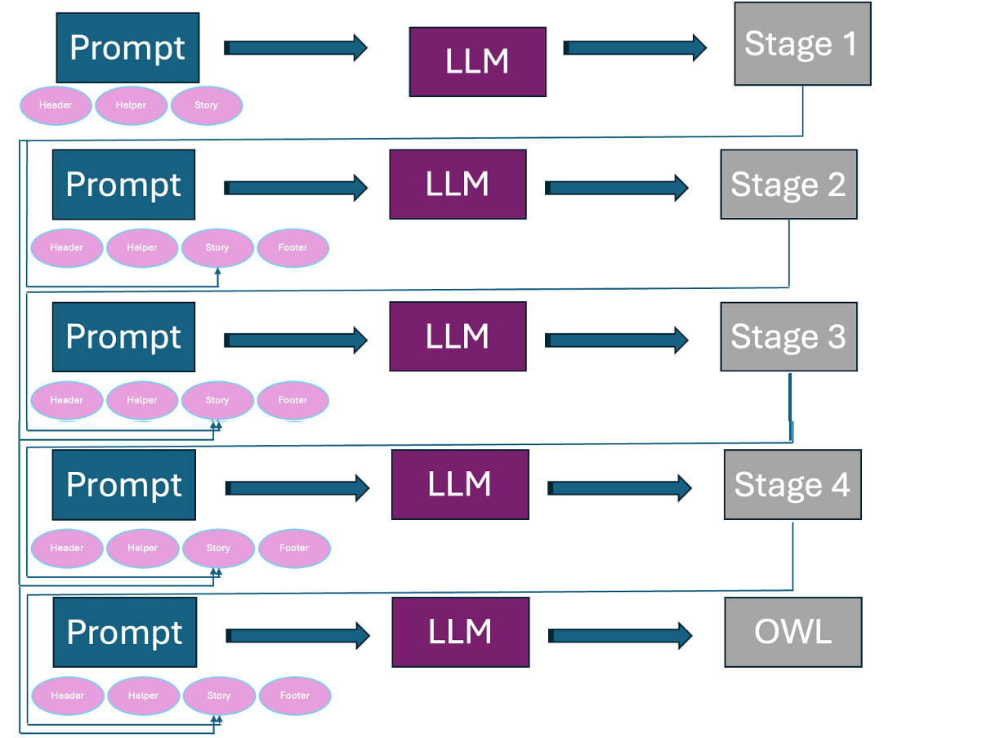

## [Sub-task Decomposed Prompting - Waterfall](#Waterfall)
The LLM prompting method involves **five stages**. Initially, the LLM translates core requirements into short descriptions. In the second stage, it extracts classes. In the third stage, it constructs a taxonomy. The fourth stage defines connections between established classes, and the fifth stage creates data properties. Each step includes instructions on how to establish restrictions. 
Each stage has four components: the **header**, **helper**, **story**, and **footer**. Each is designed based on the stage.
By clicking on the link, you can read details of every prompt dection in more detail.





## Waterfall
### Header, Prefixes, and Definitions (common in all stages)
**Header**: 
Your task is to contribute in creation of a well-structured ontology information that appeared in the given story, requirements, and restrictions (if there are any).

**Prefixes** : 
```
these are the prefixes:
@prefix : <http://www.example.org/test#> .
@prefix rdf: <http://www.w3.org/1999/02/22-rdf-syntax-ns#> .
@prefix rdfs: <http://www.w3.org/2000/01/rdf-schema#> .
@prefix xsd: <http://www.w3.org/2001/XMLSchema#> .
```
**Definitions**:

here are some definitions of ontology components to help you understand the problem in a better way and write better hints:
Classes are the keywords/classes that are going to be node types in the knowledge graph ontology. try to extract all classes, in addition, classes are also can be defined for reification. We use Turtle Syntax for representation. Hierarchies are rdfs:subClassOf in the turtle syntax. They can be used to classify similar classes in one superclass. To do this you can find similar nodes and create/use a class as their parent class, for example, adding the node "Cl_employee" is a good middleware and superclass for "Cl_Professors" and "Cl_Administrator" if the story is about modeling ontology of a university. Mostly the lengthier the hierarchy the better. One way can be categorizing classes into several classes and creating superclasses for them. Important: Class names have Cl_ as the prefix for example Cl_Professors. Also keep in mind you can add Equivalent To, General class axioms, Disjoint with, and Disjoint Union of, for each class.
In your ontology modeling, for each competency question, when faced with complex scenarios that involve more than two entities or a combination of entities and datatypes, apply reification. Specifically, create a pivot class to act as an intermediary for these entities, ensuring the nuanced relationships are accurately captured. For instance, when representing "a user accessed a resource at a given time", establish a pivot class like Cl_UserResourceUsage, linked from the user, resource, and the specific time of access to Cl_UserResourceInteraction, rather than directly connecting the user to both the resource and time.
Then you need to create properties (owl:Property). In this step, you use classes from the previous stage and create object and data properties to connect them and establish the ontology. Always output a turtle syntax, if you need more classes to model a competency question between more than 2 concepts, feel free to add more pivot (reification) classes here. try to find as much relation as possible by reading competency questions, restrictions, and stories. At this stage, you can create both data and object properties. Data properties are between classes or hierarchy classes and data types such as xsd:string, xsd:integer, xsd:decimal, xsd:dateTime, xsd:date, xsd:time, xsd:boolean, xsd:byte, xsd:double, xsd:float and etc. For example, in the university domain, we have: employee_id a owl:Property ; rdfs:domain :cl_teacher ; rdfs:range xsd:integer. Object properties are between classes. try to find as much relation as possible by reading competency questions and the story. Feel free to use rdfs:subPropertyOf for creating hierarchies for relations. For modeling properties (object or data properties) if it is necessary, use these relations characteristics: Functional, Inverse functional, Transitive, Symmetric, Asymmetric, Reflexive, and Irreflexive. Also, you are flexible in domain and range so you can use Cl_class1 or Cl_class2 in domain and range or disjoint with, the inverse of between relations.


### Stage 1:
#### Helper

Your task is to assist students by providing hints for ontology development without giving them code. Your task is to only append some information (in a very short text) to the story. so read the story, competency questions, and restrictions, then write in short (translate) what the object properties, data properties, and reification nodes are needed. do not do any coding, just write CQ1: (competency question #1: ) object properties: rel1, rel2 ...; data properties: p1, p2, p3; classes: ...; reification nodes: Cl_n1, Cl_n2,... CQ2: ...

<code style="color : blue">{definisions}</code>

Important: do not solve the ontology (it is cheating, we want hints for students) just put the information mentioned above. Don't put any code, just write the object properties: el1, rel2 ...;
instruction for student: '
CQ1: (competency question #1: ) object properties: rel1, rel2 ...; data properties: p1, p2, p3; classes: ...; reification nodes: Cl_n1, Cl_n2,... CQ2: ...

<code style="color : blue">{prefixes}</code>

Important: your output should be only owl turtle. Don't write any explanation before the code block or after. Also, the code must have 0 comments.
### Story
Ontology story comes from users' input 

#### Footer (pitfalls)
Empty at this stage

### Stage 2:
#### Helper
The way to approach this is you first create classes. Classes are the keywords/classes that will be node types in the knowledge graph ontology (see the definitions bellow). Try to extract all classes. We use Turtle Syntax for representation. Important: Class names have Cl_ as a prefix for example Cl_Professors.  Also keep in mind you can add Equivalent To, General class axioms, Disjoint with, and Disjoint Union of, for each class. In this step, don't extract any properties (object property or data property.), only classes. extracting hierarchies and properties do not belong to this stage (so don't use subClassOf in this stage).

<code style="color :blue">{definisions}</code>


<code style="color : blue">{prefixes}</code>

### Story
Ontology story comes from users' input + <span style="color:blue">**Previous LLM output (from stage 1)**</span> 

#### Footer (pitfalls)
Besides here are some possible mistakes that you might do:

1- forgetting to add prefixes at the beginning of the code.

2- forgetting to add pivot classes (reifications).

common mistakes in the class extraction:

1- not extracting all classes and missing many of them. classes can be found in story, competency questions and restrictions.

2- returning empty answer

3- providing comments or explanations

4- extracting classes like 'Date' is wrong since they are data properties.

5- not adding prefixes at the start of the turtle or not using them or creating new one


### Stage 3:
#### Helper
The way to approach this is you first read classes in the bottom. Classes are the keywords/classes that will be node types in the knowledge graph ontology (see the definitions bellow) and represented with turtle syntax with other properties like equivalentClass or disjointWith. your output must be turtle and rewrite everything: meaning the output should be an independent turtle code. When you read the classes, now try to create a category to seperate them into a hierarchy structure. Hierarchies are subClassOf in turtle. One way to approach this is categorizing classes into different classes and creating a super class and connect them toghether: e.g. if we have classes like Cl_professor, Cl_lecturer, Cl_HR, you can create a super node called Cl_universityEmployee and they all be subClassOf this node. Some super classes in the hierarchies could be: Location, Physical Object, Role, organization, group, relationship, culture, system, etc. In this step, don't extract any properties (object property or data property.) only and only create hierarchies. extracting properties are not belong to this stage. Note you do not need to create hierarchies for reification node (optional).

<code style="color :blue">{definisions}</code>


<code style="color : blue">{prefixes}</code>


### Story
Ontology story comes from users' input + <span style="color:blue"> **First LLM output (from stage 1)** </span> +  <span style="color:blue"> **RDF code from stage 2**</span> 

### Footer (pitfalls)

Besides here are some possible mistakes that you might do:

 forgetting to add prefixes at the beginning of the code.
 
common mistakes in the class hierarchy extraction:

1- creating ontology for non-existing classes.
  
2- returning empty answer or very short

3- providing comments or explanations

4- extracting attributes such as date, time, string names that are related to data properties

5- syntax error in turtle

6- forgetting Cl_ prefix

7- forgetting to add prefixes or not adding (if any exist) Equivalent To, General class axioms, Disjoint with and Disjoint Union of, form the previous turtle code.

### Stage 4:
#### Helper
The way to approach this is you first read classes and hierarchies in the provided rdf represented with turtle syntax with other properties like equivalentClass or disjointWith. Classes are the keywords/classes that are going to be nodes types in the knowledge graph ontology. your output must be turtle and do not rewrite everything only append: meaning the output should be concatinated with the provided rdf to become an complete error free turtle code. Hierarchies are subClassOf in turtle.
Second step, after reading the rdf, is to find object properties. you should use this template: property_name rdf:type owl:Property. Object properties are defined between two classes in the ontology, meaning that domain and range must be classes not strings, integers or dates. based on the story, restrictions and competency questions try to find as much relation as possible to connect them together. in this stage do not find any data properties since they do not belong to this stage. For modeling object properties, if it is necessary, use these relations characteristics like: Functional, Inverse functional, Transitive, Symmetric, Asymmetric, Reflexive, Irreflexive, Inverse Of (reverse of another relation). Also you are flexible in domain and range so you can use Cl_class1 or Cl_class2 in domain and range or disjoint with, inverse of between relations.
Feel free to create more classes and pivot classes (reification) here, but not data properties.


<code style="color :blue">{definisions}</code>


<code style="color : blue">{prefixes}</code>

### Story
Ontology story comes from users' input + <span style="color:blue"> **First LLM output (from stage 1)** </span> +  <span style="color:blue"> **RDF code from stage 3** </span> 

### Footer 
Remeber, do not rewrite the rdf again, just append to the given rdf in turtle.

Besides here are some possible mistakes that you might do:

common mistakes in the object properties extraction, avoid these:

1- returning empty answer or very short

2- providing comments or explanations

3- writing prefixes again at the begining of your response

4- using different prefixes

5- not using owl:Property and instead writing owl:ObjectProperty
   
### Stage 4:
#### Helper
The way to approach this is you first read classes and hierarchies in the provided rdf represented with turtle syntax with other properties like equivalentClass or disjointWith. your output must be turtle and do not rewrite everything only append: meaning the output should be concatinated with the provided rdf to become an complete error free turtle code.
Second step, after reading the rdf, is to find data properties based on story and its competency questions. you should use this template: property_name rdf:type owl:Property. Data properties are defined between one class in the ontology and a data type, meaning that domain must be a class in ontology and range must be data types like xsd:string, xsd:integer, xsd:decimal, xsd:dateTime, xsd:date, xsd:time, xsd:boolean, xsd:byte, xsd:double, xsd:float and etc. based on the story, restrictions and competency questions try to find as much relation as possible to connect them together. For modeling data properties, if it is necessary, use these relations characteristics like: Disjoint with, Inverse Of (reverse of another relation), Equivalent to, Subproperty of, etc. Also you are flexible in domain and range so you can use Cl_class1 or Cl_class2 in domain  or disjoint with, inverse of between relations.
Feel free to add more classes, reification classes, object properties at this stage.


<code style="color :blue">{definisions}</code>


<code style="color : blue">{prefixes}</code>

### Story
Ontology story comes from users' input + <span style="color:blue"> **First LLM output (from stage 1)** </span> +  <span style="color:blue"> **RDF code from stage 4** </span> 


### Footer
Remeber, do not rewrite the rdf again, just append to the given rdf in turtle.

Besides here are some possible mistakes that you might do:

common mistakes in the object properties extraction, avoid these:

1- returning empty answer or very short

2- providing comments or explanations

3- writing prefixes again at the begining of your response

4- using different prefixes

5- not using owl:Property and instead writing owl:ObjectProperty
