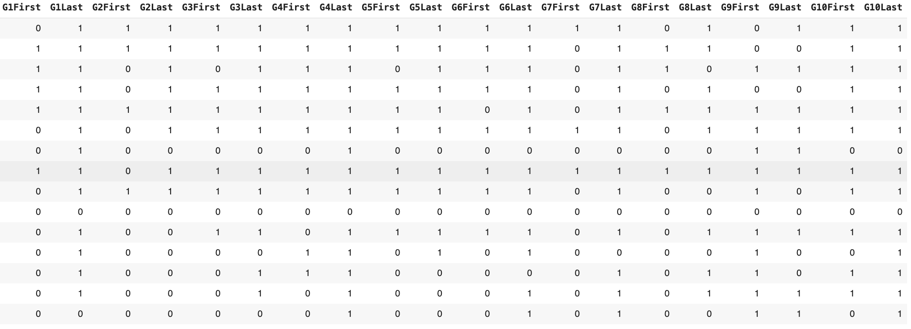
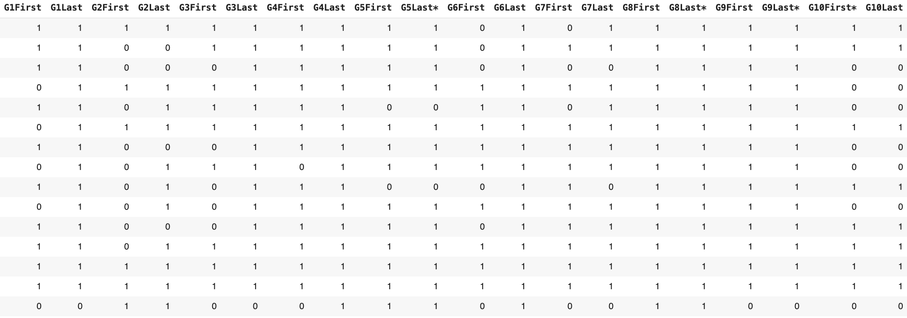
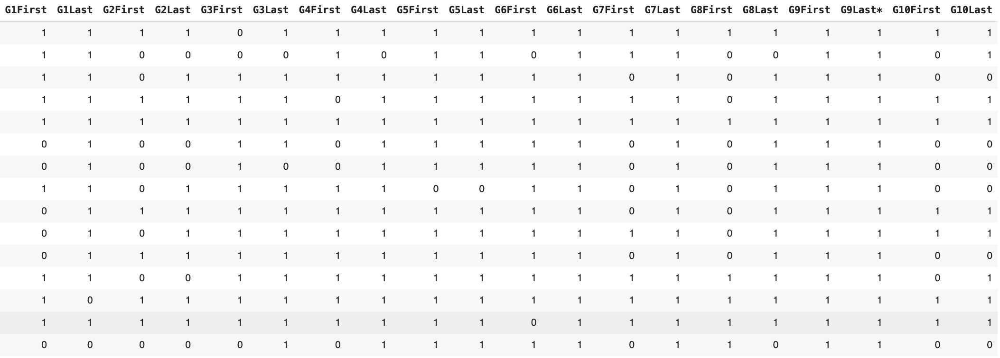

# Here are ontology stories in the experiments
In our experiment, we have two sets of experiments, the Initial experiment and the Main experiment. 
### Goals in short narratives
 - Vegetarians: the individual rabbit must be classified as a non-vegetarian (Error Provocation)
 - Lena: the individual Lena must be classified as a Car (Error Provocation)
 - Big Festival: The existence of a class "Big festival" or a way to extract a big festival (according to definitions) is examined (Inference Verification)
### Goals in ontology stories (the main experiment)
The goal is simple, we want an ontology that can answer/model all CQs. Answering/modeling a CQ is done when a SPARQL query can be written to extract the answer to the CQ.
Competency questions in all of these three stories (for the main experiment) are similar. As described in the paper, we have four types of CQs: 
- 1- **Simple data property**: to model this CQ, we need a data property and sometimes a class
- 2- **Simple object property**: to model this CQ, we need an object property between two classes, sometimes one or two classes must be created.
- 3- **Reification**: Complex scenario, a reification class (or relation class) which is a node type must be added and all properties must be added to the reification class.
- 4- **Restrictions**: establishing subClassOf or any other axioms that restrict relations between classes.

Here you can find which CQs from the ontology stories are in which one of these categories:

1-	Data properties: M10, H12, T1, M2, H6, T7, M4, H2, T9, M6, H11, T11, M8, H3, T13

2-	Object property: M12, H14, T2, M13, H4, T4, M14, H5, T5, M7, H9, T6, M1, H1, T8, M5, H10, T10

3-	Reification: M11, H13, T3, M9, H8, T12, M3, H7, T14

4-	Restrictions: M15, H15, T15

H-> Hospital story, M -> Music production, T -> Theatre festival. For example, H4 means Hospital story CQ number 4.

The stories are as follows:

## Short Narratives (Initial Experiment)
### Story 1: Vegetarians
**Text of the story:**

This story discusses two primary food categories: vegetarian foods and meat. Vegetarian animals exclusively eat vegetables, while non-vegetarian animals can consume vegetables or meat without restrictions on their diets. In the context of animals, rabbits are given as an example of vegetarian eaters. The relation "eats" describes the relationship between animals and the types of food they consume.
here are the competency questions:
```
[ '1- There are two types of food: vegetarian foods and non-vegetarian foods.',
  '2- vegetarian animals do not eat meat but only vegetables.',
  '3- Non-vegetarian animals eat vegetables or meat without any restrictions.',
  '4- Rabbits eat only vegetarian foods.',
  '5- Relation eats is a relation between animals and foods.',
  '6- create an individual rabbit R1 that eats individual meat m1']
```
### Story 2: Cars Story
**Text of the story:**

This narrative outlines a unique world that models relationships between gender, preferences, and objects, allowing for insights and deductions based on the set ontology.
here are the competency questions:
```
['1- Women are defined as persons that are also female (hint: you can use a class intersection)',
'2- A person cannot be both a man and a woman (hint: disjointness)',
'3- Persons are either men or women (hint: you can use a class union)',
'4- Liking something is a relation applicable to persons (hint: use a domain restriction)',
'5- A car is a kind of vehicle (hint: subclass relation)',
'6- Ferrari and Alfa Romeo are Italian cars (hint: in this case we will model car brands as instances of cars, we do not care about individual physical cars)',
'7- All women like some car (hint: others may also like cars, so use a subclass restriction rather than an equivalent class)',
'8- Women like only Italian cars. Men like at least one car.',
'9- Clara is a woman, so is Samantha. Clara\'s full name is Clara Smith (hint: use either rdfs:label or create a datatype property)',
'10- Clara is 30 years old. Samantha and Clara are different individuals',
'11- Sam is the same person as Samantha',
'12- To adore is a special case of liking, where the thing being liked is always a car',
'13- To be adored by is the inverse of adoring',
'14- To have a part is a transitive relation. Cars have some wheels as parts',
'15- Add an instance of a woman named Lena, add a man named Thomas, then add the fact that Thomas adores Lena. Run a reasoner over the ontology. What is concluded about Lena?',]
```
### Story 3: Big Festival
**Text of the story:**

In this ontology modeling, we are trying to model a theatre festival ontology. A theatre festival is a curated event or series of events that showcase a variety of theatrical performances, often held over a specific period of time in a particular location. These festivals bring together multiple theatre productions, ranging from plays and musicals to experimental and avant-garde performances. Each festival has several plays in it.
here are the competency questions:
```
['When and where does a festival happen?',
 'What is the duration of a festival?',
 'A large festival is defined as a festival with more than three plays in it.']
```
<hr>

## Ontology Narratives (Main Experiment)
### Story 1: Theatre Festival
####Theatre productions
During each year a number of theatre festivals are held in cities around Italy. In January 2007 a festival called “Roma Loves Shakespeare” took place in Rome. Two different productions of “The Merchant of Venice” participated, one from a theatre in Pisa and the other from a theatre institute in Venice, featuring an ensemble of university art students. Other plays were Othello and a Midsummer Night’s Dream.
The Grand Theatre in Rome offers two theatre shows each evening during September and October 2009. The play set up in this period is the "Merchant of Venice",given through an ensemble of well-known Italian actors. The Merchant of Venice was written during 1596 to 1598 by William Shakespeare, and it has 5 distinct acts. The premier of this production at The Grand Theatre was on September 7. Il Gazzettino gave the setup of the play 5 stars in a recent review.
Fabio Bianchi is an Italian actor employed at the theatre since May 2004, he is a part of the ensemble setting up the Merchant of Venice and he plays the Duke of Venice but also a servant in one of the scenes. During the second and third week of September the role of Shylock is played by Arnold Schwarzenegger as a special guest actor.
here are the competency questions:
```
['1- When did a certain theatre festival take place?',
'2- Where did a certain festival take place?',
'3- What plays could be seen during a certain theatre festival?',
'4- In what city is a certain theatre located?',
'5- In what country is a certain city located?',
'6- What play is the basis of this production?',
'7- Who are the members of a certain ensemble at a certain point in time? ',
'8- What plays did a certain author write?',
'9- During what time period was a certain play written?',
'10- How many acts does a particular play contain?',
'11- When was the premier of a certain production?',
'12- What is the “star rating” given by a certain newspaper for a certain production?',
'13- At what time did a certain actor start working for a specific theatre?',
'14- What roles does a certain person have within a certain production at a certain point in time?  ',
'15- A production has exactly one premier.',]
```
### Story 2: Music Production
Music production
The current configuration of the “Red Hot Chili Peppers” are: Anthony Kiedis (vocals), Flea (bass, trumpet, keyboards, and vocals), John Frusciante (guitar), and Chad Smith (drums).  The line-up has changed a few times during they years, Frusciante replaced Hillel Slovak in 1988, and when Jack Irons left the band he was briefly replaced by D.H. Peligo until the band found Chad Smith. In addition to playing guitars for Red hot Chili Peppers Frusciante also contributed to the band “The Mars Volta” as a vocalist for some time.
From September 2004, the Red Hot Chili Peppers started recording the album “Stadium Arcadium”. The album contains 28 tracks and was released on May 5 2006. It includes a track of the song “Hump de Bump”, which was composed in January 26, 2004.
The critic Crian Hiatt defined the album as "the most ambitious work in his twenty-three-year career". On August 11 (2006) the band gave a live performance in Portland, Oregon (US), featuring songs from Stadium Arcadium.
here are the competency questions:
```
['1- What instruments does a certain person play?',
'2- What are the members of a certain band at a certain point in time?',
'3- What role does a certain person have in a certain band at a certain point in time?',
'4- During what time period was a certain album recorded?',
'5- How many tracks does a particular album contain?',
'6- When was a certain album released?',
'7- What song is a specific track a recording of?',
'8- When was a certain song composed?',
'9- What does a certain critic say about a certain record?',
'10- When did a certain performance take place?',
'11- What songs were played in a certain performance?',
'12- Where did a certain performance take place?',
'13- In what region is a certain city located?',
'14- In what country is a certain region located?',
'15- A record always contains at least one track.',]
```
### Story 2: Hospital Story
Hospital setting
Pasquale Di Gennaro first studied to become a nursing assistant, but after working some years he decided to continue studying to become a certified nurse. He took his degree in May 2001. On September 21 (2001) he was employed at Ospedale Riunito delle Tre Valli in the city of Nocera Inferiore (IT). In the hospital there are different unions organising the staff. Pasquale Di Gennaro has been the union representative for male nurses at Ospedale Riunito delle Tre Valli from 2002. Senior doctors regularly evaluate all employees working with patient care, and these written statements are stored for future reference.
To constantly update their knowledge both nurses and doctors read research articles that can be found in article collections at the hospital library. Article collections are usually available both as books and electronically on CDs. In 2008 an article collection entitled “Nurse practices in cancer patient care – longitudinal studies at Italian hospitals” was published as a book. The book contains an article by Pasquale Di Gennaro, entitled “A 5 year-program for improving cancer care – experiences and future directions”. In total the book version of this collection has 346 pages. For discussing new articles Italian hospitals regularly hold seminars where a number of articles are presented. In December 2008 such a seminar was held in Nocera Inferiore at Ospedale Riunito delle Tre Valli.
here are the competency questions:
```
['1- What medical degrees does a certain person have?',
'2- During what time period did a certain person study for a specific degree?',
'3- When was a certain person first employed at a certain hospital?',
'4- In what city is a certain hospital located?',
'5- In what country is a certain city located?',
'6- Who are the members of a certain union at a certain point in time?',
'7- What role does a certain person have within a certain union group at a certain point in time?',
'8- What is the evaluation statement given by a certain doctor for a certain employee?',
'9- What articles is a specific book or CD composed of?',
'10- How many pages does a particular book contain?',
'11- When was a certain book or CD published?',
'12- When did a certain seminar take place?',
'13- What articles were presented in a certain seminar?',
'14- Where did a certain seminar take place?',
'15- At least one article is always presented at each seminar.',]
```
## Students submission stats

The three ontology stories used in this study originate from a series of courses, master's and PhD level, held at universities across Europe for the past 15 years. The tasks were initially developed to allow for experimenting with tool and methodology support for ontology engineering. Hence, they are comparable in size and level of difficulty and cover a set of similar modelling problems, although set in three different domains. This makes the tasks also ideal for experimenting with the new kind of tool support that LLMs constitute. 

In this study, we specifically compared the automatically generated ontologies suggested by LLMs with the solutions created by student groups in a master's course in 2009. The computer science students had a series of lectures on OWL and ontology engineering and basic knowledge of logic but no prior experience in OWL and ontologies before encountering these tasks. However, they completed an initial modelling exercise, attended lectures on OWL and ontology engineering, and used the Protégé tool prior to performing the modelling of the stories.

As a comparison to the automatically generated ontologies suggested by LLMs, we have used a set of solutions for these tasks produced by the student groups in a master's course in 2009. The course contained a module on OWL modelling, and prior to the practical tasks, the students had a series of lectures on OWL and ontology engineering. They had also performed one initial modelling exercise before these more advanced tasks, getting to know the Protégé tool and using the basic constructs of the OWL language. Still, the students were to be considered novice ontology engineers since none of them had additional prior experience in OWL and ontologies. They did, however, have basic knowledge of logic in general and otherwise typical backgrounds of computer science master students, e.g. familiarity with ER-modelling and UML, as well as reasonable programming skills.  

Students submitted their first attempt to the teacher, received feedback, and improved their solutions. Most groups submitted their solutions at least twice and, in some cases, up to 5 submissions, and the final submission was the one approved for passing the task. Students worked primarily in groups of 2, but sometimes in groups of 3 or alone. As mentioned, there are three similar stories, and each story was modelled by 10 groups of students. Their final submissions for all stories contained approximately 23±3 classes, 24±5 object properties, and 8±3 data properties.
For each task, the students handed in their first attempt to the teacher got some feedback, and usually also requested to complement the solution with missing parts or fix modelling mistakes. Hence, most student groups handed in their solution at least twice, but sometimes up to 5 times before passing the task. The last solution of each group was always the one based on which they passed that course task. Students worked on the tasks primarily in groups of 2, but in rare cases, groups of 3 (or students working alone) were allowed. Additionally, there are three stories modelled based on the 10 groups of students. The stories are similar, and the students' final submissions to the course contain approximately 23±3 classes, 24±5 object properties, and 8±3 data properties.
We argue that the first submissions of student solutions would be comparable to what an average junior programmer would come up with after perhaps studying some online tutorials without task-specific guidance or feedback. The last student submission represents an acceptable solution to the modelling problem, i.e., an ontology of sufficient quality with only a few minor issues still remaining. This gives us a bar to compare with when assessing the LLM-generated models in terms of quality and modelling mistakes.

We argue that the student solutions, i.e. their first submission, would be comparable to what an average junior programmer would come up with after perhaps studying some online tutorials or similar. The last student submission, i.e. the one rendering a pass for that course task, represents an acceptable solution to the modelling problem, i.e. an ontology of sufficient quality with only a few issues still remaining. This gives us a bar to compare the LLM-generated models in terms of quality and modelling mistakes.

Here are the student's performances on the first submissions and the last (e.g. G1First means student group number 1, first submission), 0 means their modelling cannot answer the CQ in that row, and 1 means it can model the CQ:

### Theatre story:



### Theatre story, minor errors are ignored:


### Music story:



### Music story, minor errors are ignored:


### Hospital story:



### Hospital story, minor errors are ignored:


